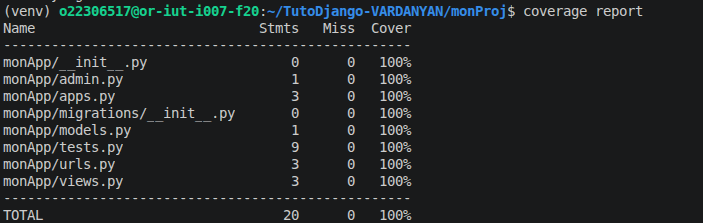

# TutoDjango-VARDANYAN
Cours de programation avancée de Sargis VARDANYAN  31b

Lancement : 
    creation de venv : virtualenv ~/venv
    activation de venv: source ~/venv/bin/activate
    instalation des requirements: pip install -r requirements.txt

TD1
Petit challenge à faire
couverture des tests
