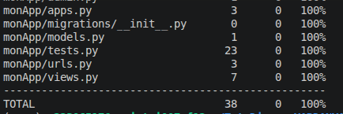

# TutoDjango-VARDANYAN
Cours de programation avancée de Sargis VARDANYAN  31b

Lancement : 
    creation de venv : virtualenv ~/venv

    activation de venv: source ~/venv/bin/activate

    instalation des requirements: pip install -r requirements.txt

    manage.py migrate

    manage.py runserver

TD1

couverture des tests

couverture de home, contact et about 

